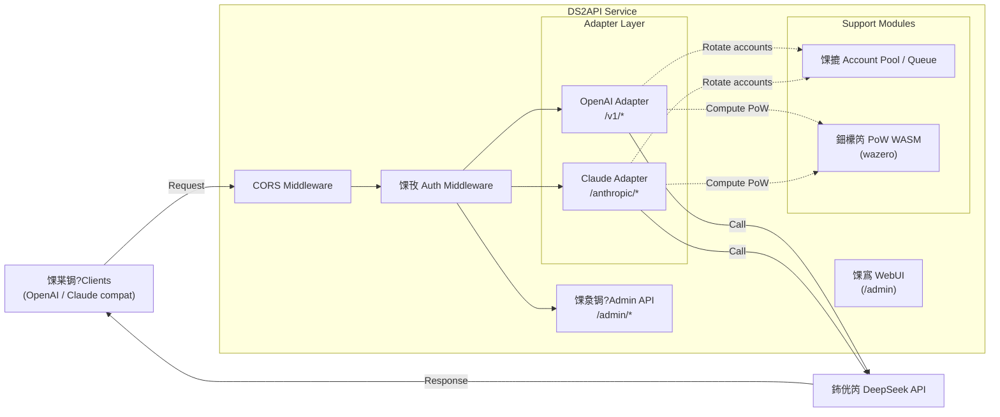

# DS2API

[](LICENSE)


[](version.txt)
[](DEPLOY.en.md)

Language: [涓枃](README.MD) | [English](README.en.md)

DS2API converts DeepSeek Web chat capability into OpenAI-compatible and Claude-compatible APIs. The backend is a **pure Go implementation**, with a React WebUI admin panel (source in `webui/`, build output auto-generated to `static/admin` during deployment).

## Architecture Overview



- **Backend**: Go (`cmd/ds2api/`, `api/`, `internal/`), no Python runtime
- **Frontend**: React admin panel (`webui/`), served as static build at runtime
- **Deployment**: local run, Docker, Vercel serverless, Linux systemd

## Key Capabilities

| Capability | Details |
| --- | --- |
| OpenAI compatible | `GET /v1/models`, `GET /v1/models/{id}`, `POST /v1/chat/completions`, `POST /v1/responses`, `GET /v1/responses/{response_id}`, `POST /v1/embeddings` |
| Claude compatible | `GET /anthropic/v1/models`, `POST /anthropic/v1/messages`, `POST /anthropic/v1/messages/count_tokens` |
| Multi-account rotation | Auto token refresh, email/mobile dual login |
| Concurrency control | Per-account in-flight limit + waiting queue, dynamic recommended concurrency |
| DeepSeek PoW | WASM solving via `wazero`, no external Node.js dependency |
| Tool Calling | Anti-leak handling: non-code-block feature match, early `delta.tool_calls`, structured incremental output |
| Admin API | Config management, account testing/batch test, import/export, Vercel sync |
| WebUI Admin Panel | SPA at `/admin` (bilingual Chinese/English, dark mode) |
| Health Probes | `GET /healthz` (liveness), `GET /readyz` (readiness) |

## Platform Compatibility Matrix

| Tier | Platform | Status |
| --- | --- | --- |
| P0 | Codex CLI/SDK (`wire_api=chat` / `wire_api=responses`) | 鉁?|
| P0 | OpenAI SDK (JS/Python, chat + responses) | 鉁?|
| P0 | Vercel AI SDK (openai-compatible) | 鉁?|
| P0 | Anthropic SDK (messages) | 鉁?|
| P1 | LangChain / LlamaIndex / OpenWebUI (OpenAI-compatible integration) | 鉁?|
| P2 | MCP standalone bridge | Planned |

## Model Support

### OpenAI Endpoint

| Model | thinking | search |
| --- | --- | --- |
| `deepseek-chat` | 鉂?| 鉂?|
| `deepseek-reasoner` | 鉁?| 鉂?|
| `deepseek-chat-search` | 鉂?| 鉁?|
| `deepseek-reasoner-search` | 鉁?| 鉁?|

### Claude Endpoint

| Model | Default Mapping |
| --- | --- |
| `claude-sonnet-4-5` | `deepseek-chat` |
| `claude-haiku-4-5` (compatible with `claude-3-5-haiku-latest`) | `deepseek-chat` |
| `claude-opus-4-6` | `deepseek-reasoner` |

Override mapping via `claude_mapping` or `claude_model_mapping` in config.
In addition, `/anthropic/v1/models` now includes historical Claude 1.x/2.x/3.x/4.x IDs and common aliases for legacy client compatibility.

## Quick Start

### Universal First Step (all deployment modes)

Use `config.json` as the single source of truth (recommended):

```bash
cp config.example.json config.json
# Edit config.json
```

Recommended per deployment mode:
- Local run: read `config.json` directly
- Docker / Vercel: generate Base64 from `config.json` and inject as `DS2API_CONFIG_JSON`

### Option 1: Local Run

**Prerequisites**: Go 1.24+, Node.js 20+ (only if building WebUI locally)

```bash
# 1. Clone
git clone https://github.com/CJackHwang/ds2api.git
cd ds2api

# 2. Configure
cp config.example.json config.json
# Edit config.json with your DeepSeek account info and API keys

# 3. Start
go run ./cmd/ds2api
```

Default URL: `http://localhost:5001`

> **WebUI auto-build**: On first local startup, if `static/admin` is missing, DS2API will auto-run `npm install && npm run build` (requires Node.js). You can also build manually: `./scripts/build-webui.sh`

### Option 2: Docker

```bash
# 1. Prepare env file
cp .env.example .env

# 2. Generate DS2API_CONFIG_JSON from config.json (single-line Base64)
DS2API_CONFIG_JSON="$(base64 < config.json | tr -d '\n')"

# 3. Edit .env and set:
#    DS2API_ADMIN_KEY=replace-with-a-strong-secret
#    DS2API_CONFIG_JSON=${DS2API_CONFIG_JSON}

# 4. Start
docker-compose up -d

# 5. View logs
docker-compose logs -f
```

Rebuild after updates: `docker-compose up -d --build`

### Option 3: Vercel

1. Fork this repo to your GitHub account
2. Import the project on Vercel
3. Set environment variables (minimum: `DS2API_ADMIN_KEY`; recommended to also set `DS2API_CONFIG_JSON`)
4. Deploy

Recommended first step in repo root:

```bash
cp config.example.json config.json
# Edit config.json
```

Recommended: convert `config.json` to Base64 locally, then paste into `DS2API_CONFIG_JSON` to avoid JSON formatting mistakes:

```bash
base64 < config.json | tr -d '\n'
```

> **Streaming note**: `/v1/chat/completions` on Vercel is routed to `api/chat-stream.js` (Node Runtime) for real-time SSE. Auth, account selection, and session/PoW preparation are still handled by the Go internal prepare endpoint; streaming output (including `tools`) is assembled on Node with Go-aligned anti-leak handling.

For detailed deployment instructions, see the [Deployment Guide](DEPLOY.en.md).

### Option 4: Download Release Binaries

GitHub Actions automatically builds multi-platform archives on each Release:

```bash
# After downloading the archive for your platform
tar -xzf ds2api_v1.7.0_linux_amd64.tar.gz
cd ds2api_v1.7.0_linux_amd64
cp config.example.json config.json
# Edit config.json
./ds2api
```

### Option 5: OpenCode CLI

1. Copy the example config:

```bash
cp opencode.json.example opencode.json
```

2. Edit `opencode.json`:
- Set `baseURL` to your DS2API endpoint (for example, `https://your-domain.com/v1`)
- Set `apiKey` to your DS2API key (from `config.keys`)

3. Start OpenCode CLI in the project directory (run `opencode` using your installed method).

> Recommended: use the OpenAI-compatible path (`/v1/*`) via `@ai-sdk/openai-compatible` as shown in the example.
> If your client supports `wire_api`, test both `responses` and `chat`; DS2API supports both paths.

## Configuration

### `config.json` Example

```json
{
  "keys": ["your-api-key-1", "your-api-key-2"],
  "accounts": [
    {
      "email": "user@example.com",
      "password": "your-password",
      "token": ""
    },
    {
      "mobile": "12345678901",
      "password": "your-password",
      "token": ""
    }
  ],
  "model_aliases": {
    "gpt-4o": "deepseek-chat",
    "gpt-5-codex": "deepseek-reasoner",
    "o3": "deepseek-reasoner"
  },
  "compat": {
    "wide_input_strict_output": true
  },
  "toolcall": {
    "mode": "feature_match",
    "early_emit_confidence": "high"
  },
  "responses": {
    "store_ttl_seconds": 900
  },
  "embeddings": {
    "provider": "deterministic"
  },
  "claude_model_mapping": {
    "fast": "deepseek-chat",
    "slow": "deepseek-reasoner"
  }
}
```

- `keys`: API access keys; clients authenticate via `Authorization: Bearer <key>`
- `accounts`: DeepSeek account list, supports `email` or `mobile` login
- `token`: Leave empty for auto-login on first request; or pre-fill an existing token
- `model_aliases`: Map common model names (GPT/Codex/Claude) to DeepSeek models
- `compat.wide_input_strict_output`: Keep `true` (current default policy)
- `toolcall`: Fixed to feature matching + high-confidence early emit
- `responses.store_ttl_seconds`: In-memory TTL for `/v1/responses/{id}`
- `embeddings.provider`: Embeddings provider (`deterministic/mock/builtin` built-in)
- `claude_model_mapping`: Maps `fast`/`slow` suffixes to corresponding DeepSeek models

### Environment Variables

| Variable | Purpose | Default |
| --- | --- | --- |
| `PORT` | Service port | `5001` |
| `LOG_LEVEL` | Log level | `INFO` (`DEBUG`/`WARN`/`ERROR`) |
| `DS2API_ADMIN_KEY` | Admin login key | `admin` |
| `DS2API_JWT_SECRET` | Admin JWT signing secret | Same as `DS2API_ADMIN_KEY` |
| `DS2API_JWT_EXPIRE_HOURS` | Admin JWT TTL in hours | `24` |
| `DS2API_CONFIG_PATH` | Config file path | `config.json` |
| `DS2API_CONFIG_JSON` | Inline config (JSON or Base64) | 鈥?|
| `DS2API_WASM_PATH` | PoW WASM file path | Auto-detect |
| `DS2API_STATIC_ADMIN_DIR` | Admin static assets dir | `static/admin` |
| `DS2API_AUTO_BUILD_WEBUI` | Auto-build WebUI on startup | Enabled locally, disabled on Vercel |
| `DS2API_ACCOUNT_MAX_INFLIGHT` | Max in-flight requests per account | `2` |
| `DS2API_ACCOUNT_CONCURRENCY` | Alias (legacy compat) | 鈥?|
| `DS2API_ACCOUNT_MAX_QUEUE` | Waiting queue limit | `recommended_concurrency` |
| `DS2API_ACCOUNT_QUEUE_SIZE` | Alias (legacy compat) | 鈥?|
| `DS2API_VERCEL_INTERNAL_SECRET` | Vercel hybrid streaming internal auth | Falls back to `DS2API_ADMIN_KEY` |
| `DS2API_VERCEL_STREAM_LEASE_TTL_SECONDS` | Stream lease TTL seconds | `900` |
| `VERCEL_TOKEN` | Vercel sync token | 鈥?|
| `VERCEL_PROJECT_ID` | Vercel project ID | 鈥?|
| `VERCEL_TEAM_ID` | Vercel team ID | 鈥?|
| `DS2API_VERCEL_PROTECTION_BYPASS` | Vercel deployment protection bypass for internal Node鈫扜o calls | 鈥?|

## Authentication Modes

For business endpoints (`/v1/*`, `/anthropic/*`), DS2API supports two modes:

| Mode | Description |
| --- | --- |
| **Managed account** | Use a key from `config.keys` via `Authorization: Bearer ...` or `x-api-key`; DS2API auto-selects an account |
| **Direct token** | If the token is not in `config.keys`, DS2API treats it as a DeepSeek token directly |

Optional header `X-Ds2-Target-Account`: Pin a specific managed account (value is email or mobile).

## Concurrency Model

```
Per-account inflight = DS2API_ACCOUNT_MAX_INFLIGHT (default 2)
Recommended concurrency = account_count 脳 per_account_inflight
Queue limit = DS2API_ACCOUNT_MAX_QUEUE (default = recommended concurrency)
429 threshold = inflight + queue 鈮?account_count 脳 4
```

- When inflight slots are full, requests enter a waiting queue 鈥?**no immediate 429**
- 429 is returned only when total load exceeds inflight + queue capacity
- `GET /admin/queue/status` returns real-time concurrency state

## Tool Call Adaptation

When `tools` is present in the request, DS2API performs anti-leak handling:

1. Toolcall feature matching is enabled only in **non-code-block context** (fenced examples are ignored)
2. Once high-confidence features are matched (`tool_calls` + `name` + `arguments/input` start), `delta.tool_calls` is emitted immediately
3. Confirmed toolcall JSON fragments are never leaked into `delta.content`
4. Natural language before/after toolcalls keeps original order, with incremental argument output supported

## Project Structure

```text
ds2api/
鈹溾攢鈹€ cmd/
鈹?  鈹溾攢鈹€ ds2api/              # Local / container entrypoint
鈹?  鈹斺攢鈹€ ds2api-tests/        # End-to-end testsuite entrypoint
鈹溾攢鈹€ api/
鈹?  鈹溾攢鈹€ index.go             # Vercel Serverless Go entry
鈹?  鈹溾攢鈹€ chat-stream.js       # Vercel Node.js stream relay
鈹?  鈹斺攢鈹€ helpers/             # Node.js helper modules
鈹溾攢鈹€ internal/
鈹?  鈹溾攢鈹€ account/             # Account pool and concurrency queue
鈹?  鈹溾攢鈹€ adapter/
鈹?  鈹?  鈹溾攢鈹€ openai/          # OpenAI adapter (incl. tool call parsing, Vercel stream prepare/release)
鈹?  鈹?  鈹斺攢鈹€ claude/          # Claude adapter
鈹?  鈹溾攢鈹€ admin/               # Admin API handlers
鈹?  鈹溾攢鈹€ auth/                # Auth and JWT
鈹?  鈹溾攢鈹€ config/              # Config loading and hot-reload
鈹?  鈹溾攢鈹€ deepseek/            # DeepSeek API client, PoW WASM
鈹?  鈹溾攢鈹€ server/              # HTTP routing and middleware (chi router)
鈹?  鈹溾攢鈹€ sse/                 # SSE parsing utilities
鈹?  鈹溾攢鈹€ util/                # Common utilities
鈹?  鈹斺攢鈹€ webui/               # WebUI static file serving and auto-build
鈹溾攢鈹€ webui/                   # React WebUI source (Vite + Tailwind)
鈹?  鈹斺攢鈹€ src/
鈹?      鈹溾攢鈹€ components/      # AccountManager / ApiTester / BatchImport / VercelSync / Login / LandingPage
鈹?      鈹斺攢鈹€ locales/         # Language packs (zh.json / en.json)
鈹溾攢鈹€ scripts/
鈹?  鈹溾攢鈹€ build-webui.sh       # Manual WebUI build script
鈹?  鈹斺攢鈹€ testsuite/           # Testsuite runner scripts
鈹溾攢鈹€ static/admin/            # WebUI build output (not committed to Git)
鈹溾攢鈹€ .github/
鈹?  鈹溾攢鈹€ workflows/           # GitHub Actions (Release artifact automation)
鈹?  鈹溾攢鈹€ ISSUE_TEMPLATE/      # Issue templates
鈹?  鈹斺攢鈹€ PULL_REQUEST_TEMPLATE.md
鈹溾攢鈹€ config.example.json      # Config file template
鈹溾攢鈹€ .env.example             # Environment variable template
鈹溾攢鈹€ Dockerfile               # Multi-stage build (WebUI + Go)
鈹溾攢鈹€ docker-compose.yml       # Production Docker Compose
鈹溾攢鈹€ docker-compose.dev.yml   # Development Docker Compose
鈹溾攢鈹€ vercel.json              # Vercel routing and build config
鈹溾攢鈹€ go.mod / go.sum          # Go module dependencies
鈹斺攢鈹€ version.txt              # Version number
```

## Documentation Index

| Document | Description |
| --- | --- |
| [API.md](API.md) / [API.en.md](API.en.md) | API reference with request/response examples |
| [DEPLOY.md](DEPLOY.md) / [DEPLOY.en.md](DEPLOY.en.md) | Deployment guide (local/Docker/Vercel/systemd) |
| [CONTRIBUTING.md](CONTRIBUTING.md) / [CONTRIBUTING.en.md](CONTRIBUTING.en.md) | Contributing guide |
| [TESTING.md](TESTING.md) | Testsuite guide |

## Testing

```bash
# Unit tests
go test ./...

# One-command live end-to-end tests (real accounts, full request/response logs)
./scripts/testsuite/run-live.sh

# Or with custom flags
go run ./cmd/ds2api-tests \
  --config config.json \
  --admin-key admin \
  --out artifacts/testsuite \
  --timeout 120 \
  --retries 2
```

## Release Artifact Automation (GitHub Actions)

Workflow: `.github/workflows/release-artifacts.yml`

- **Trigger**: only on GitHub Release `published` (normal pushes do not trigger builds)
- **Outputs**: multi-platform archives (`linux/amd64`, `linux/arm64`, `darwin/amd64`, `darwin/arm64`, `windows/amd64`) + `sha256sums.txt`
- **Each archive includes**: `ds2api` executable, `static/admin`, WASM file, config template, README, LICENSE

## Disclaimer

This project is built through reverse engineering and is provided for learning and research only. Stability is not guaranteed. Do not use it in scenarios that violate terms of service or laws.

